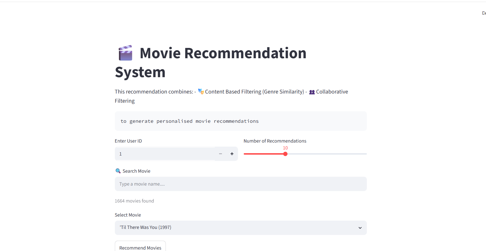
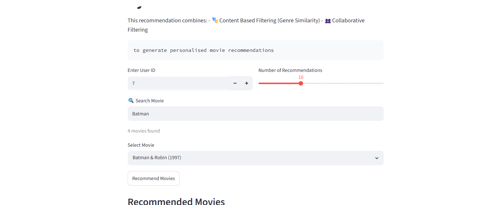
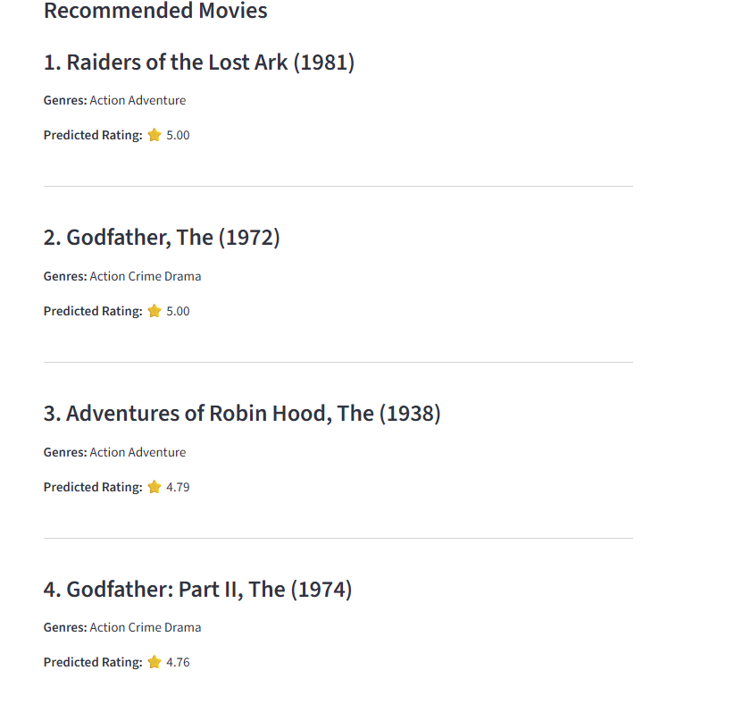

# 🎬 Hybrid Movie Recommendation System


---

## 📸 Project Screenshots

### 🏠 Home Page


### 🎯 User Input Section


### 🎬 Recommendations


---

## 🚀 Overview

A machine learning-based movie recommender system that combines **Collaborative Filtering (SVD)** and **Content-Based Filtering** to generate highly accurate, personalized movie recommendations.

This project builds a **hybrid recommendation system** that leverages the strengths of both approaches:
* 👥 **Collaborative Filtering:** Learns from user behavior and historical rating patterns.
* 🎞️ **Content-Based Filtering:** Analyzes movie metadata such as genres, overviews, and tags.

---

## 🎯 Problem Statement

Traditional recommendation systems fail due to:
- Cold-start problem
- Sparse user-item matrices
- Limited personalization

This system solves these using a hybrid ML approach.

### 💡 Why Hybrid?
Single-approach recommendation systems face distinct limitations:
* **Collaborative Filtering** suffers from the *cold-start problem* (struggling with new users or new items with no interaction data).
* **Content-Based Filtering** lacks *serendipity and user preference learning* (only recommending items highly similar to what the user already interacted with).

A hybrid approach effectively mitigates both challenges, drastically improving overall recommendation quality and accuracy.

---

## 🧠 System Architecture & Methodology

This project follows an end-to-end **Hybrid Recommendation Pipeline** that combines Content-Based Filtering and Collaborative Filtering to generate personalized movie recommendations.

### 1. Data Layer
- Input datasets:
  - `movies.csv` (movie metadata)
  - `ratings.csv` (user-movie interactions)
- Responsible for storing and preprocessing raw data

### 2. Feature Engineering Layer (Content-Based Engine)
- Converts movie metadata into numerical representations
- Uses:
  - TF-IDF Vectorization (for text features like genres/tags)
- Computes:
  - Cosine Similarity matrix between all movies
- Output:
  - Movie-to-movie similarity scores

### 3. Collaborative Filtering Layer (SVD Model)
- Uses Surprise library
- Applies Matrix Factorization using Singular Value Decomposition (SVD)
- Learns:
  - User latent features
  - Movie latent features
- Output:
  - Predicted rating for (user, movie) pairs

### 4. Hybrid Recommendation Layer
Combines outputs from both models using a multi-stage filtering process:

1. **Candidate Generation:** Extracts the top 50 movies most similar to the selected item using Content-Based filtering.
2. **Personalized Scoring:** Feeds these 50 candidates into the trained SVD Collaborative Filtering model to predict the specific user's potential rating for each candidate.
3. **Ranking:** Sorts the candidates by predicted rating to return a highly tailored, contextually relevant list.

**Process:**
1. Take user input (User ID + Movie)
2. Generate similar movie candidates using Content-Based Filtering
3. Predict user ratings for candidates using SVD model
4. Combine both scores using weighted average
5. Rank movies based on final score
6. Return Top-N recommendations

### 5. Presentation Layer (Streamlit App)
- Provides interactive UI
- Allows user to:
  - Enter User ID
  - Select movie
  - Get recommendations in real-time
- Displays ranked movie list

---

## 📊 Dataset

**MovieLens 100K Dataset**

🔗 https://grouplens.org/datasets/movielens/100k/

---

## ✨ Features

- 🎯 Personalized movie recommendations
- 👥 Hybrid system (Collaborative + Content-based)
- ⚡ Real-time prediction via Streamlit UI
- ❄️ Cold-start problem handling
- 📊 Ranking-based recommendation system
- 💾 Model persistence using joblib
- 🔍 Movie search functionality

---

## 🛠️ Tech Stack

- Python 🐍
- Pandas, NumPy
- Scikit-learn
- Surprise (SVD Model)
- Streamlit (UI)
- Joblib (Model saving)
- Matplotlib / Seaborn (EDA)

---

## 📁 Project Structure

```text
movie-recommender/
│
├── data/                          # Datasets (CSV files, metadata, etc.)
│
├── notebooks/                     # Step-by-step Development Notebooks
│   ├── 01_data_understanding.ipynb
│   ├── 02_eda.ipynb
│   ├── 03_feature_engineering.ipynb
│   ├── 04_content_based.ipynb
│   ├── 05_collaborative.ipynb
│   └── 06_hybrid.ipynb
│
├── src/
│   ├── content.py
│   ├── collaborative.py
│   └── hybrid.py
│
├── app.py                         # Streamlit Web Application Interface
├── requirements.txt               # Project Dependencies
└── README.md                      # Project Documentation
```

---

## ⚙️ Installation

### 📋 Prerequisites
Before you begin, ensure you have the following installed:
- **Python 3.8 or higher**
- **Git**
- **pip** (Python package installer)

### 🛠️ Step-by-Step Installation

**1. Clone the Repository**
```bash
git clone https://github.com/Samarth041/Movie_Recommendation_System
cd Movie_Recommendation_System
```

**2. Create Virtual Environment (optional but recommended)**
```bash
python -m venv venv
venv\Scripts\activate   # Windows
```

**3. Install Dependencies**
```bash
pip install -r requirements.txt
```

---

## ▶️ How to Run

**1. Run Streamlit App**
```bash
python -m streamlit run app.py
```

**2. Open In Browser**

Once you run the command, Streamlit will start a local server:
```
Local URL: http://localhost:8501
```

---

## 🎯 Usage

Inside the web app:

1. Enter **User ID**
2. Select or search a **movie**
3. Click **Recommend**
4. Get personalized movie recommendations instantly 🎬

**To explore the notebooks**, run them in this order:
1. Data Understanding
2. EDA
3. Feature Engineering
4. Content-Based Filtering
5. Collaborative Filtering (SVD)
6. Hybrid Model

---

## 📊 Model Evaluation

Collaborative Filtering (SVD) performance:

| Metric | Score |
|--------|-------|
| RMSE   | ~0.93 |
| MAE    | ~0.73 |

> Content-based evaluation is qualitative based on similarity relevance.

---

## 🎬 Sample Output

### 🎯 Input Example
- 👤 **User ID:** 1
- 🎞️ **Selected Movie:** *Toy Story (1995)*

### ⚙️ Processing Flow
1. Content-Based Filtering selects movies similar to *Toy Story (1995)*
2. Collaborative Filtering (SVD) predicts user preference scores
3. Hybrid model combines both scores using weighted averaging
4. Final ranking is generated

### 📋 Output — Top 10 Recommendations

| Rank | Movie |
|------|-------|
| 1 | Toy Story 2 (1999) |
| 2 | Monsters, Inc. (2001) |
| 3 | Finding Nemo (2003) |
| 4 | Shrek (2001) |
| 5 | A Bug's Life (1998) |
| 6 | The Incredibles (2004) |
| 7 | Ice Age (2002) |
| 8 | Despicable Me (2010) |
| 9 | Up (2009) |
| 10 | WALL·E (2008) |

---

## 🚀 Future Improvements

### 🧠 1. Advanced Recommendation Models
- Replace SVD with advanced matrix factorization techniques (SVD++, NMF)
- Experiment with Deep Learning-based recommenders (Neural Collaborative Filtering)
- Use transformer-based embeddings for better content understanding

### ⚡ 2. Real-Time Recommendation System
- Convert batch system into real-time inference API
- Update recommendations dynamically based on user interactions
- Use streaming data pipelines (Kafka / Spark Streaming)

### 🌐 3. Deployment & Scalability
- Deploy backend using FastAPI or Flask
- Host Streamlit app on cloud (Streamlit Cloud / Render / AWS)
- Use Docker for containerization
- Scale using cloud infrastructure (AWS/GCP/Azure)

### 🎬 4. UI/UX Improvements
- Add movie posters and thumbnails (Netflix-style UI)
- Improve search functionality with autocomplete
- Add filters (genre, year, rating)
- Add "like/dislike" feedback system

### 👤 5. User Personalization
- Add user authentication system
- Maintain user watch history
- Improve cold-start handling using demographic data
- Build user profiles for better recommendations

### 📊 6. Evaluation Enhancements
- Add ranking metrics like Precision@K, Recall@K, MAP
- Perform A/B testing between models
- Track offline vs online performance

### 🔗 7. External Integrations
- Integrate TMDB API for live movie metadata
- Fetch real-time ratings and posters
- Add trailer preview feature

### 🧪 8. Model Optimization
- Hyperparameter tuning for SVD
- Dimensionality reduction techniques
- Optimize cosine similarity computation for large datasets

---

## 🧠 Skills Demonstrated

### 🤖 Machine Learning Skills
- Recommendation Systems design and implementation
- Collaborative Filtering using Matrix Factorization (SVD)
- Content-Based Filtering using TF-IDF and Cosine Similarity
- Hybrid Recommendation System design
- Model evaluation and performance understanding

### 📊 Data Science Skills
- Data preprocessing and cleaning
- Exploratory Data Analysis (EDA)
- Feature engineering for text and numerical data
- Handling sparse user-item interaction matrices

### 🧠 Algorithms & Concepts
- Singular Value Decomposition (SVD)
- Cosine Similarity
- Matrix Factorization
- Cold-start problem handling
- Weighted hybrid scoring systems

### 💻 Programming & Tools
- Python programming
- Pandas and NumPy for data manipulation
- Scikit-learn for ML pipelines
- Surprise library for collaborative filtering
- Joblib for model serialization

### 🌐 Deployment & Application Development
- Streamlit web application development
- End-to-end ML pipeline integration
- Modular code structure using reusable components
- Basic system design for ML applications

### 📁 Software Engineering Skills
- Project structuring (data, models, notebooks, src)
- Modular code design
- Git/GitHub project management
- Reproducible ML workflows

### 🚀 Bonus Skills
- Problem-solving for real-world recommendation challenges
- Understanding of scalability issues in recommender systems
- Designing hybrid systems for improved accuracy

---

## 👨‍💻 Author

**Samarth**
- GitHub: [@Samarth041](https://github.com/Samarth041)
- Project Repository: [Movie_Recommendation_System](https://github.com/Samarth041/Movie_Recommendation_System)
